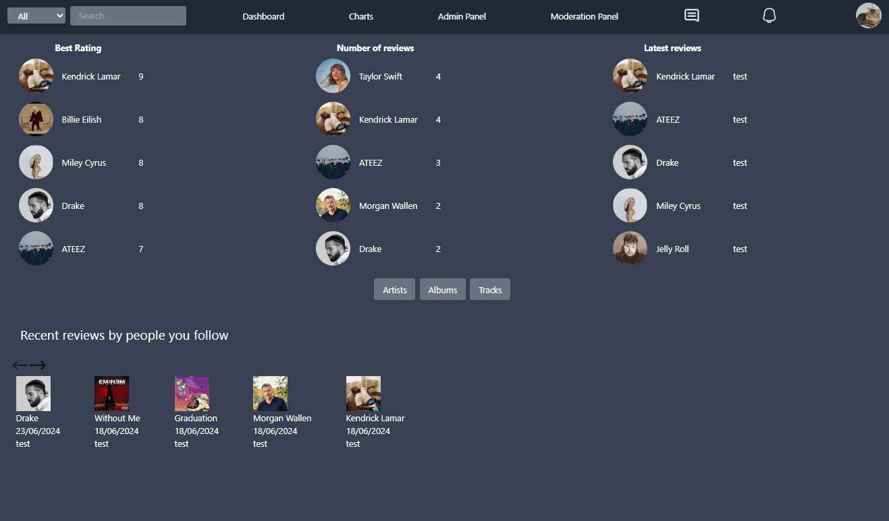
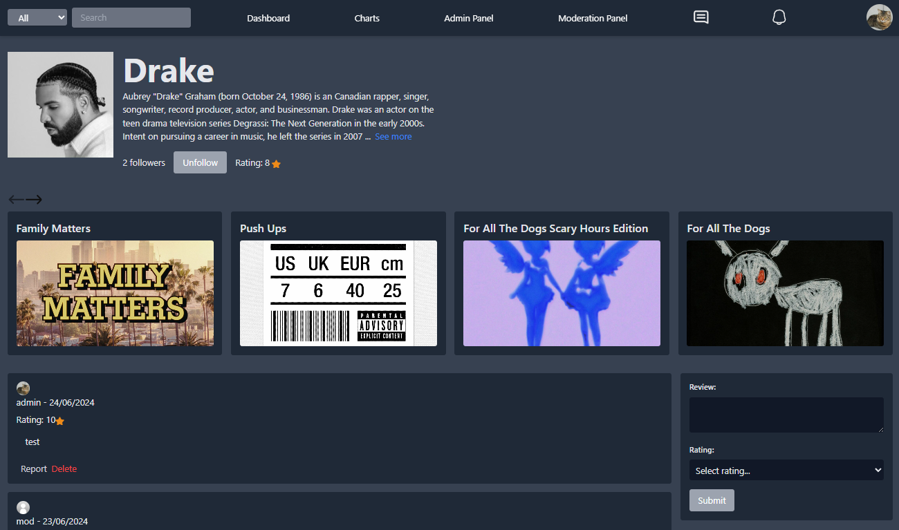
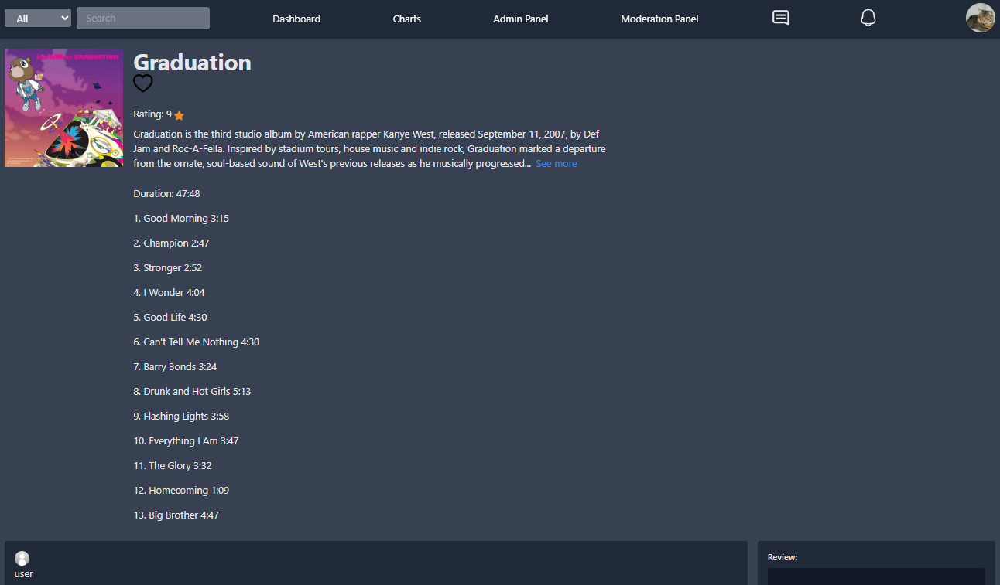
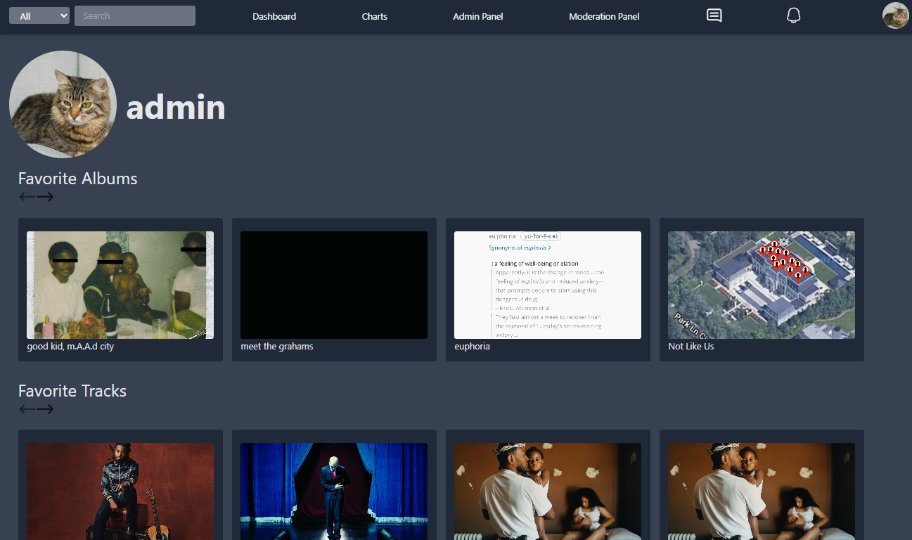
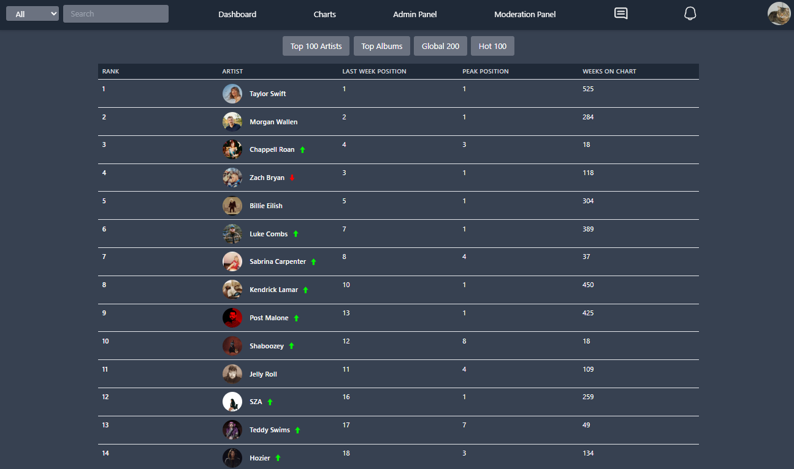
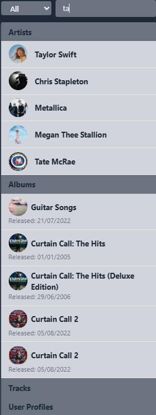

# Music Rating & Review Web Application

This is a web application for rating and reviewing music created as part of my final thesis project in college. The application allows users to explore music and share their thoughts through ratings and reviews.

## Technologies Used

- **PostgreSQL**
- **Express.js**
- **React**
- **Tailwind CSS**

## Features

- **Search Functionality**: Users can search for artists, albums, and songs.
- **Comments and Ratings**: Users can leave comments and ratings on artist, album, and song pages.
- **Statistics**: The application displays stats on the dashboard based on ratings/reviews left by users.
- **Follow Artists**: Users can follow their favorite artists and receive notifications about new releases.
- **Favorites**: Users can mark albums and songs as favorites, which will show up on their profiles.
- **Charts Page**: Fetches data directly from [Billboard.com](https://www.billboard.com) charts.
- **User Interaction**: Users can follow each other, view what others are reviewing, and send messages for real-time chat.
- **Admin Panel**: Allows administrators to manage the application by adding, deleting, and editing existing data.
- **Moderator Panel**: Used to manage malicious reviews and ensure quality content.

## Getting Started

To run the application, ensure you have Docker installed. Then follow these steps:

1. Clone the repository:

   ```bash
   git clone https://github.com/jlonic/zavrsni.git
   ```

2. Navigate into the cloned directory:
   ```bash
   cd zavrsni
   ```

3. Run the application using Docker Compose:
   ```bash
   docker-compose up
   ```

4. Once the process is finished, the application should be running at http://localhost:3000

## Testing the Application

You can log in using the following credentials to test the application:

- **Admin Username**: admin
- **Admin Password**: admin

Alternatively, you can create your own account.

**Note**: The database data is from June 2024 and has not been updated since then.

## Known Issues
**These issues do not occur when the application is run locally, so there are no plans to fix them as this is just for preview.**
- On the charts page, only the 'Hot 100' chart works in Docker.
- Some images are broken and do not display properly.

## Application Screenshots

### Dashboard


### Artist Page


### Album Page


### User Page


### Charts Page


### Search

